# Proyecto-QUANTIFY
### QUANTIFY - ADVANCED HABIT TRACKER E IDENTIDAD GRAFICA

 La identidad grafica de QUANTIFY busca transmitir valores de disciplina, analisis, estetica ingenieril y progreso constante. El diseño, fundamentado en el principio de "Engineering Aesthetic" (entorno oscuro, alto contraste y lineas tecnicas precisas), resalta la extrema importancia de la mineria de datos y un entorno hiperpreciso enfocado a usuarios con mentalidad de ingenieria y de alto rendimiento.

## LOGOTIPOS

<table>
  <tr>
    <td>Logo de la Aplicacion</td>
  </tr>
  <tr>
    <td align="center">
      
    </td>
  </tr>
</table>

## INDICE DE CONTENIDOS
1. [Descripción](#descripcion)
2. [Planteamiento del Problema](#planteamiento-del-problema)
3. [Propuesta de Solución](#propuesta-de-solucion)
4. [Objetivo General](#objetivo-general)
5. [Objetivos Específicos](#objetivos-especificos)
6. [Diagrama de Gantt](#diagrama-de-gantt)
7. [Organigrama de Trabajo](#organigrama-de-trabajo)
8. [Evidencia y Capturas](#evidencia-y-capturas)
9. [Lista de Tecnologías](#lista-de-tecnologias)

---

### DESCRIPCION

QUANTIFY es una plataforma avanzada de seguimiento de habitos personales, la cual, a diferencia de los modelos tradicionales propensos al engaño, incorpora inteligencia artificial, evaluacion biometrica y analisis de telemetria inmutable. A traves de este sistema buscamos revolucionar la manera en que los usuarios perciben su productividad, generando evaluaciones biologicas reales (Ej. probabilidad de burnout y arquetipos) mientras mantienen un registro fidedigno garantizado mediante arquitectura transaccional dual.

---

### PLANTEAMIENTO DEL PROBLEMA

El seguimiento de la salud y la productividad en la actualidad adolece de un grave problema de falseo de registros: la mayoria de aplicaciones dependen de la honestidad simplista del usuario y carecen de un cruce con telemetria real (como niveles de estres, tiempo de sueño o fatiga acumulada). Esta vulnerabilidad genera falsos positivos en las recompensas psicologicas del usuario (rachas irreales que no reflejan el esfuerzo verdadero). La carencia de analisis serios a estos registros imposibilita detectar tempranamente problemas cronicos de organizacion, falta de descanso y su correlacion critica con desbalances en la salud general humana.

---

### PROPUESTA DE SOLUCION

En respuesta a la superficialidad de las plataformas tradicionales, proponemos un sistema robusto, amparado por arquitecturas Hibridas (SQL/NoSQL) y Machine Learning. Nuestro entorno intercepta los registros, evalua la telemetria cruzada y procesa masivos logs en un Motor de Gamificacion para asegurar que la constancia y las recompensas del sistema reflejen la disciplina en su estado mas puro e infalsificable.

---

### OBJETIVO GENERAL

Desarrollar e implementar un sistema de software integral e hibrido (Web y Smartwatch Wear OS) especializado en la mineria, cuantificacion exhaustiva y analisis de los habitos humanos; utilizando inteligencia artificial para extraer valor predictivo que le permita al usuario prevenir el desgaste extremo, optimizar sus tiempos de descanso y forjar un estilo de vida de elite y sostenible.

---

### OBJETIVOS ESPECIFICOS

<strong>Arquitectura de Alta Tolerancia Transaccional</strong>: Construir e implementar una base de datos hibrida aislando la seguridad de clientes (Transaccional/SQL) del procesamiento masivo del estres y analiticas generadas del usuario (Event Sourcing/MongoDB).

<strong>Interfaces Inmersivas (Engineering Aesthetic)</strong>: Diseñar y montar paneles de mandos ejecutivos reactivos (Dashboards Web) orientados a una asimilacion ultra-rapida de datos y graficos tecnicos cientificos.

<strong>Algoritmos Preventivos (Salud/Burnout)</strong>: Programar e ingerir modelos de Machine Learning (Supervisados y No Supervisados) que alerten tempranamente al usuario sobre sus posibilidades de colapso fisico, identificando ademas su arquetipo productivo subyacente.

<strong>Calculo Realista de Metas</strong>: Desarrollar un Motor Logico inquebrantable protegido contra sobre-ingestas e ingenieria inversa, forzando a los usuarios a registrar datos de vital importancia sin alteraciones, avalando unicamente el crecimiento real.

<strong>Control Perimetral y Monitoreo Movil</strong>: Desplegar extensiones seguras para dispositivos wearables (Smartwatches), facultandolos para actuar en redes WiFi/Bluetooth para sincronizar estadisticas y biometria via esquemas locales OTP aislados de la saturacion web.

---

### DIAGRAMA DE GANTT

---

### ORGANIGRAMA DE TRABAJO

  <table>
    <tr>
      <th align="center" colspan="5">Distribución del Equipo de Ingeniería</th>
    </tr>
    <tr>
      <td align="center">
        
👤
 
        <strong>Angel de Jesus B.</strong> 
        <em>1. Tech Lead & Arquitectura</em>
      </td>
      <td align="center">
        
👤
 
        <strong>Francisco Garcia</strong> 
        <em>2. Machine Learning / Python</em>
      </td>
      <td align="center">
        
👤
 
        <strong>Al Farias Leyva</strong> 
        <em>3. Frontend UX/UI & Sockets</em>
      </td>
      <td align="center">
        
👤
 
        <strong>Brian Jesus M.</strong> 
        <em>4. Backend & API</em>
      </td>
      <td align="center">
        
👤
 
        <strong>Alejandro Artiaga</strong> 
        <em>5. Data QA y Simulaciones</em>
      </td>
    </tr>
  </table>

---

### EVIDENCIA Y CAPTURAS

> *Galería de Interfaces y Plataforma de Mando.*

#### Entorno Web (Dashboard & Analítica)

  <table>
    <tr>
      <td align="center">
        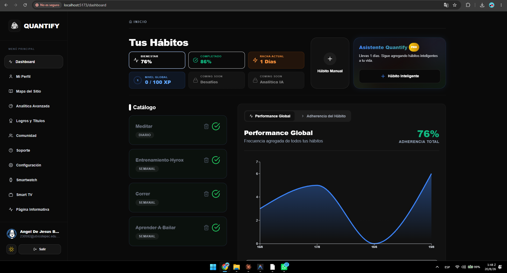 
        <em>Dashboard Principal</em>
      </td>
      <td align="center">
         
        <em>Módulo de Analítica Avanzada</em>
      </td>
    </tr>
    <tr>
      <td align="center">
        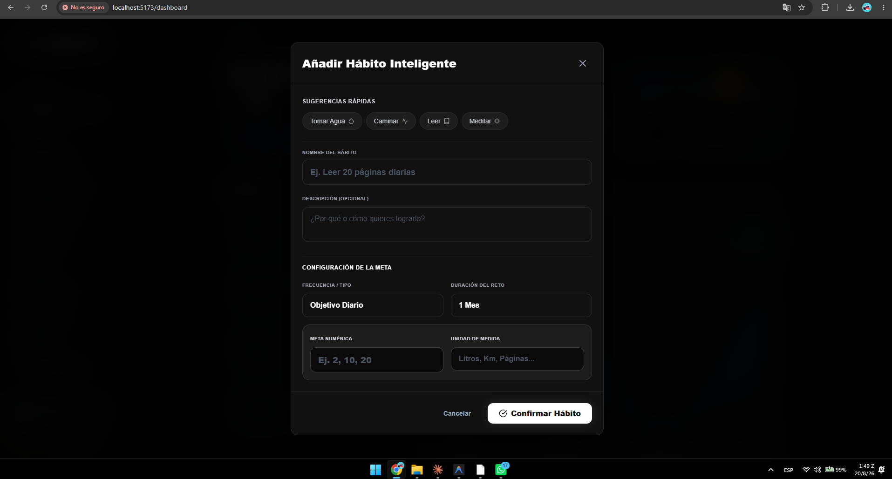 
        <em>Comunidad y Logros</em>
      </td>
      <td align="center">
        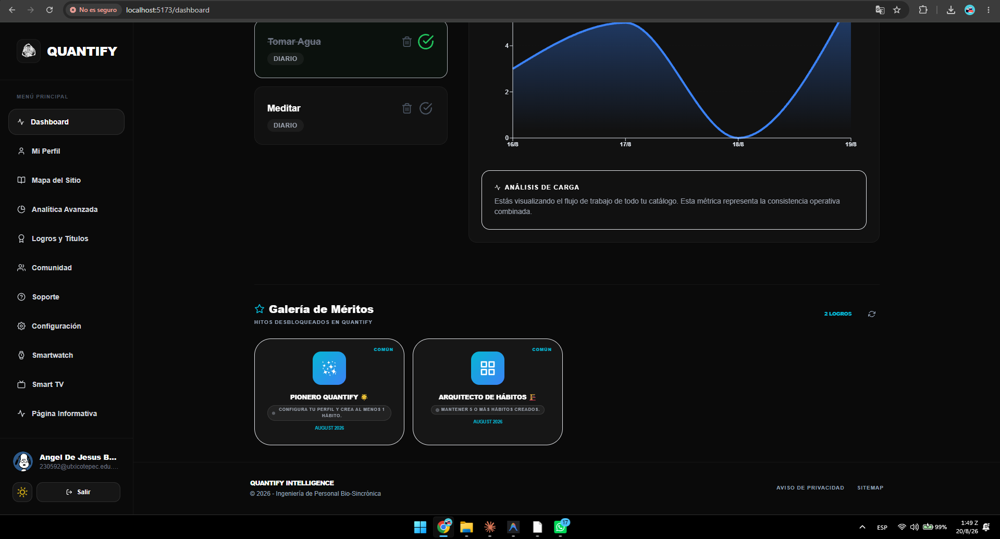 
        <em>Panel Administrativo</em>
      </td>
    </tr>
    <tr>
      <td align="center">
        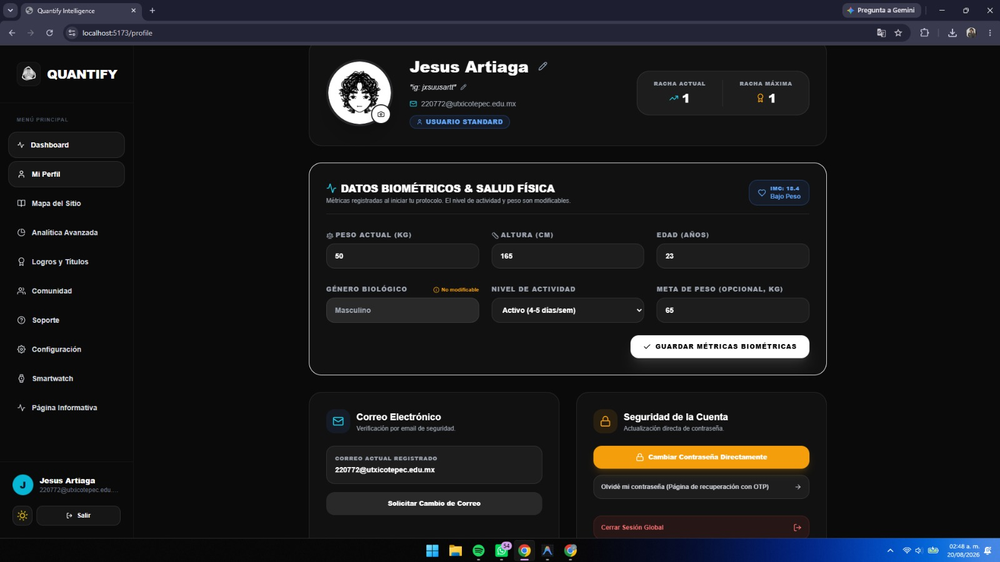 
        <em>Página Informativa</em>
      </td>
      <td align="center">
        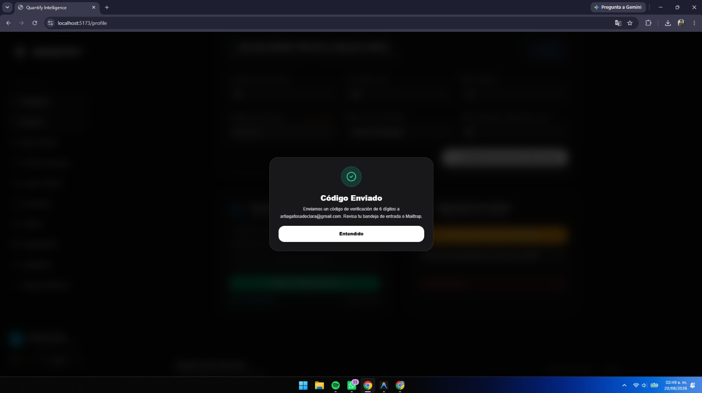 
        <em>Autenticación y Captura</em>
      </td>
    </tr>
    <tr>
      <td align="center">
        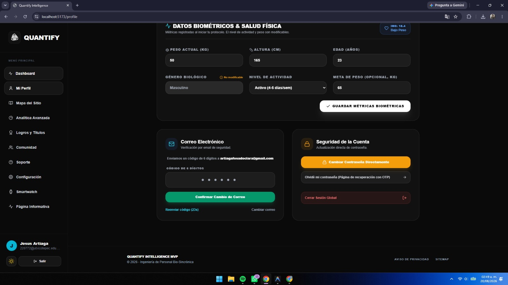 
        <em>Asistente de Onboarding</em>
      </td>
      <td align="center">
        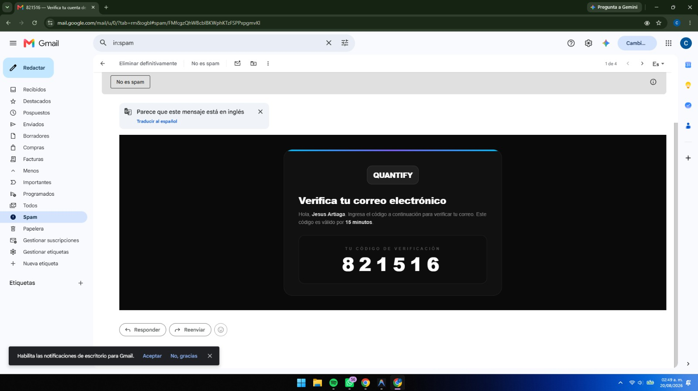 
        <em>Mi Perfil</em>
      </td>
    </tr>
    <tr>
      <td align="center">
        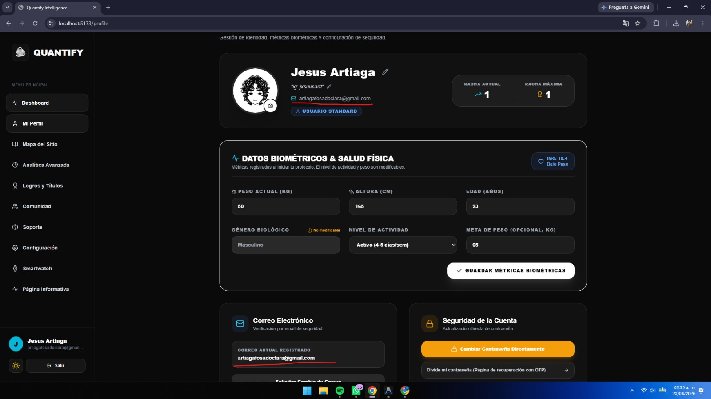 
        <em>Mapa del Sitio y Exploración</em>
      </td>
      <td align="center">
        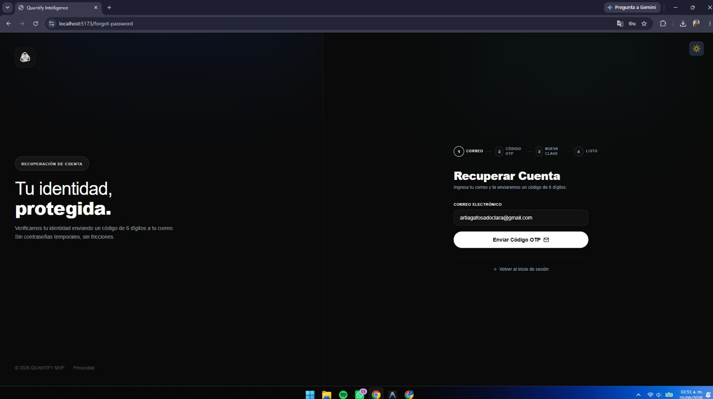 
        <em>Centro de Soporte</em>
      </td>
    </tr>
    <tr>
      <td align="center">
        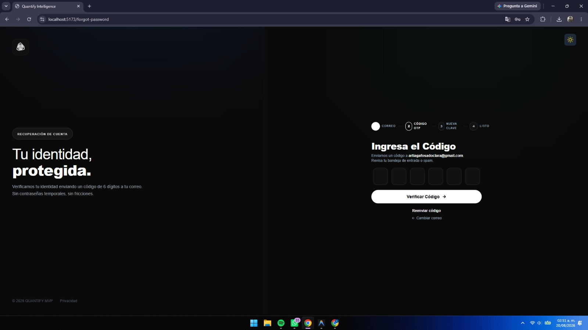 
        <em>Configuraciones del Sistema</em>
      </td>
      <td align="center">
        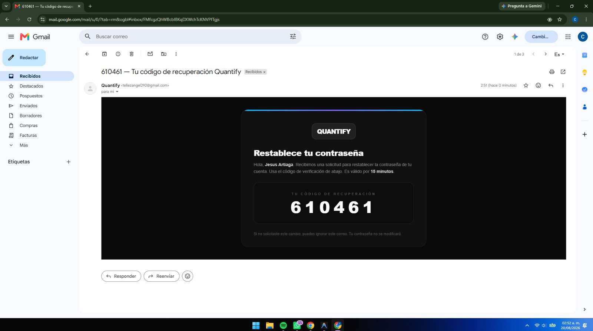 
        <em>Sincronización de Componentes</em>
      </td>
    </tr>
  </table>

#### Entorno WearOS (Aplicación Smartwatch)

  <table>
    <tr>
      <td align="center">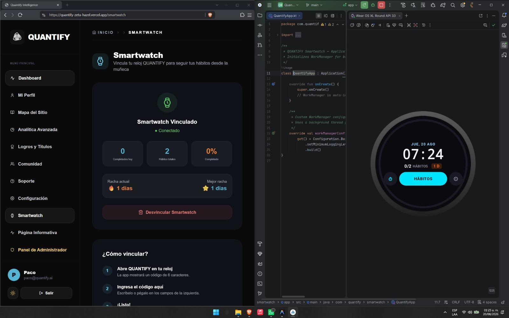</td>
      <td align="center"></td>
      <td align="center"></td>
      <td align="center"></td>
    </tr>
    <tr>
      <td align="center"></td>
      <td align="center"></td>
      <td align="center"></td>
      <td align="center"></td>
    </tr>
  </table>

#### Entorno Smart TV (App Android TV)

  <table>
    <tr>
      <td align="center">
        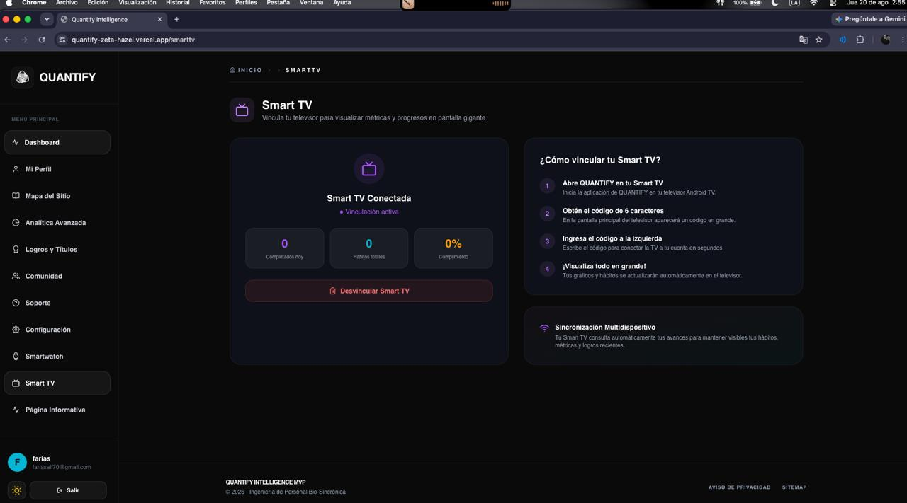 
        <em>Sincronización de Avances Globales</em>
      </td>
      <td align="center">
        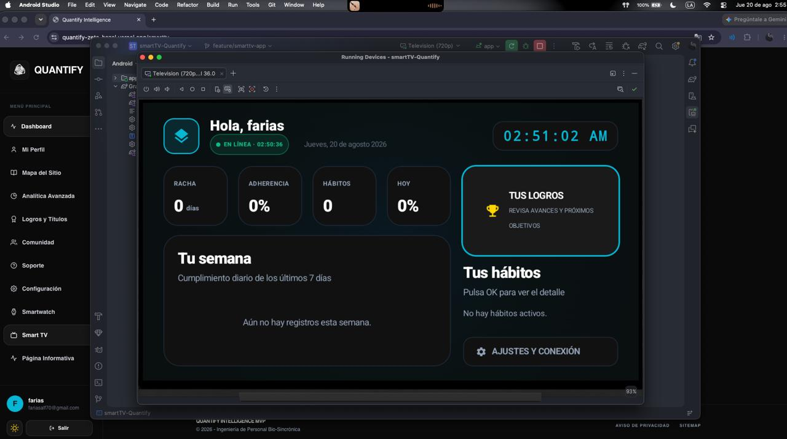 
        <em>Lectura de Métricas a Distancia</em>
      </td>
    </tr>
    <tr>
      <td align="center" colspan="2">
        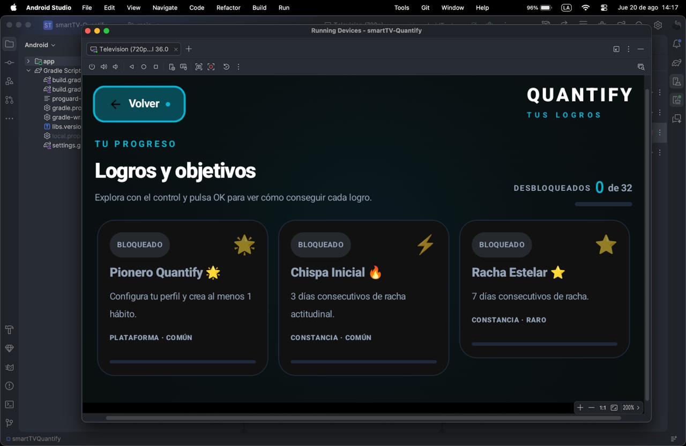 
        <em>Entorno Integrado en Pantalla Grande</em>
      </td>
    </tr>
  </table>

---

### LISTA DE TECNOLOGIAS

*Frontend Web y Pantallas:*

*Backend y Microservicios:*

*Bases de Datos e In-Memory:*

*Inteligencia Artificial y Ciencia de Datos:*

*DevOps, QA y Herramientas:*

