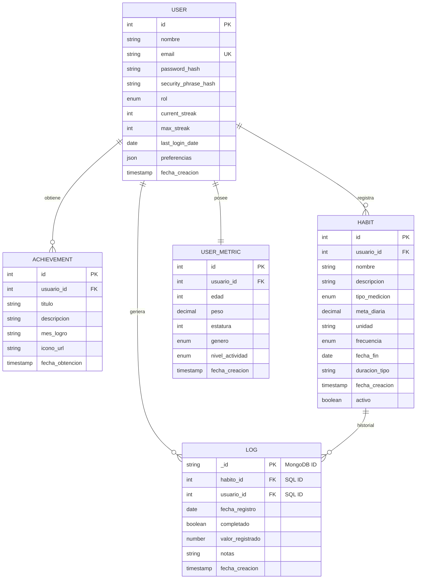

# QUANTIFY

Aplicación para seguimiento de hábitos personales (Habit Tracker) diseñada para ayudar a los usuarios a construir rutinas positivas mediante registro, seguimiento y análisis de hábitos.

## Objetivo

Permitir a los usuarios:

- Crear hábitos
- Registrar progreso diario
- Visualizar estadísticas
- Mantener consistencia en sus objetivos

## Tecnologías Usadas

### Frontend
- **Framework:** [React 19](https://react.dev/)
- **Build Tool:** [Vite](https://vitejs.dev/)
- **Estilizado:** [Tailwind CSS](https://tailwindcss.com/)
- **Animaciones:** [Framer Motion](https://www.framer.com/motion/)
- **Gráficos:** [Recharts](https://recharts.org/)
- **Gestión de Formularios:** [Formik](https://formik.org/) & [Yup](https://github.com/jquense/yup)
- **Cliente HTTP:** [Axios](https://axios-http.com/)

### Backend
- **Entorno de Ejecución:** [Node.js](https://nodejs.org/)
- **Framework Web:** [Express.js](https://expressjs.com/)
- **ORM (SQL):** [Sequelize](https://sequelize.org/) (MySQL)
- **ODM (NoSQL):** [Mongoose](https://mongoosejs.com/) (MongoDB)
- **Autenticación:** [JWT (JSON Web Tokens)](https://jwt.io/) & [Bcrypt.js](https://github.com/dcodeIO/bcrypt.js)
- **Envío de Correos:** [Nodemailer](https://nodemailer.com/)

### Base de Datos
- **MySQL:** Almacenamiento de datos relacionales (Usuarios, Hábitos, Logros).
- **MongoDB:** Almacenamiento de logs y registros históricos de progreso.

## Diagrama Entidad-Relación (ER)

A continuación se presenta el modelo de datos del sistema, mostrando la relación entre las tablas de MySQL y la colección de logs en MongoDB:

## Estructura del proyecto

 QUANTIFY │ 
    ├── docs # Documentación del proyecto 
    ├── frontend # Aplicación cliente 
    ├── backend # API y lógica del servidor 
    ├── database # Esquemas y recursos de base de datos 
    ├── scripts # Scripts de automatización 
    └── README.md

## Flujo de trabajo

Se utiliza un flujo de ramas basado en:

- main
- develop
- feature/*

### Reglas generales

- **main** → versión estable del proyecto  
- **develop** → integración de funcionalidades  
- **feature/** → desarrollo de nuevas funcionalidades  
- **docs/** → cambios en documentación  
- **fix/** → corrección de errores 

## Convención de commits

- **feat:** nueva funcionalidad
- **fix:** corrección de errores
- **docs:** cambios en documentación
- **refactor:** mejora o reorganización del código
- **test:** pruebas
- **chore:** tareas de mantenimiento

## Equipo

Proyecto desarrollado por estudiantes de la **Universidad tecnologica de xicotepec de juarez**.

#### Integrantes

- Al Farias Leyva.
- Angel de Jesus Baños Tellez.
- Jesus Alejandro Artiaga Morales.
- Francisco Garcia Garcia.
