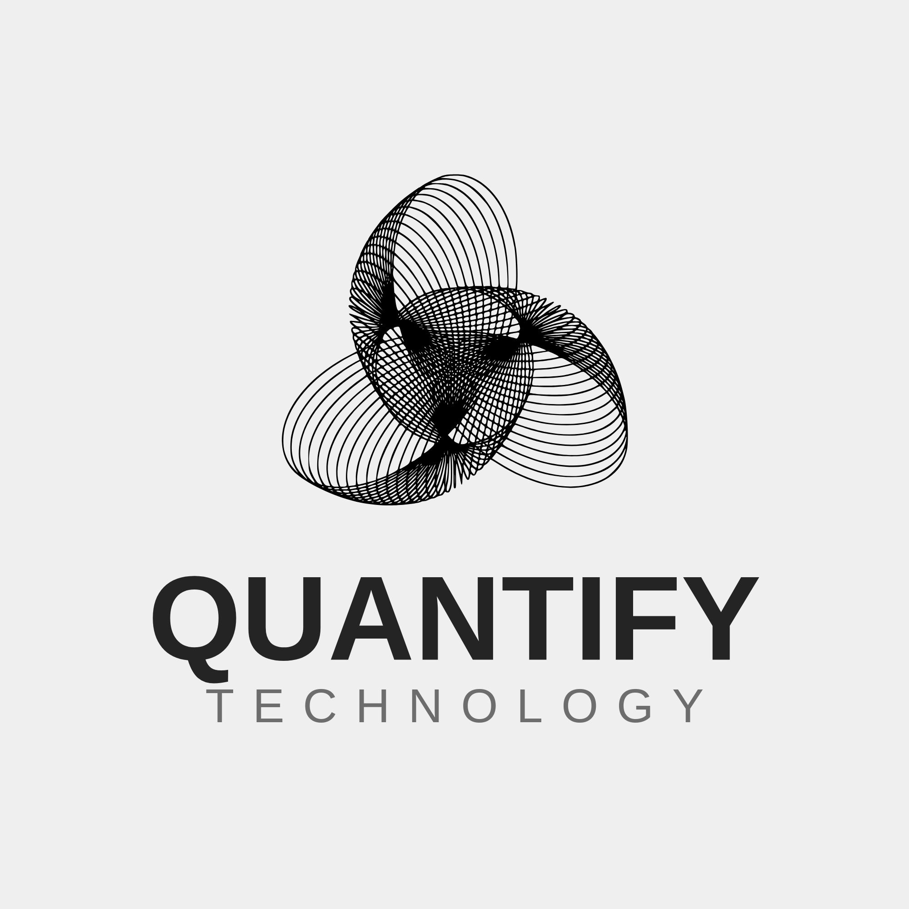
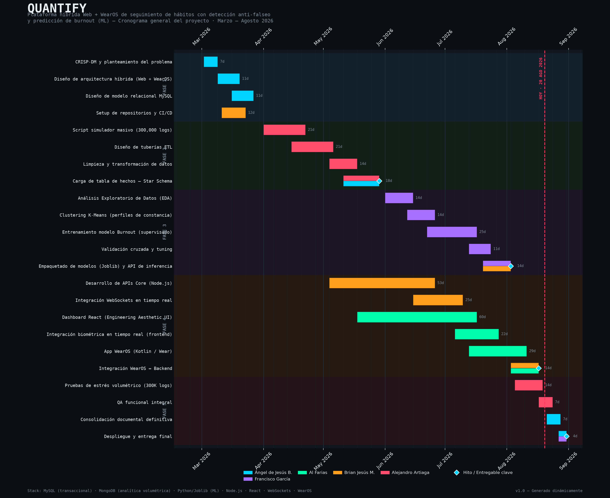
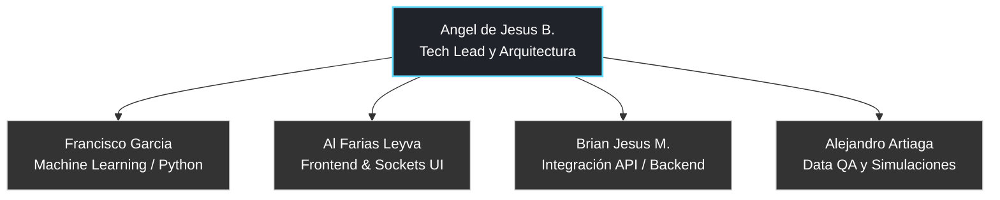

# Proyecto-QUANTIFY
### QUANTIFY - ADVANCED HABIT TRACKER E IDENTIDAD GRAFICA

 La identidad grafica de QUANTIFY busca transmitir valores de disciplina, analisis, estetica ingenieril y progreso constante. El diseño, fundamentado en el principio de "Engineering Aesthetic" (entorno oscuro, alto contraste y lineas tecnicas precisas), resalta la extrema importancia de la mineria de datos y un entorno hiperpreciso enfocado a usuarios con mentalidad de ingenieria y de alto rendimiento.

## LOGOTIPOS

<table>
   <td>Logo de la Aplicacion</td>
  <tr>
    <td>    </td>

  </tr>
</table>

### DESCRIPCION

QUANTIFY es una plataforma avanzada de seguimiento de habitos personales, la cual, a diferencia de los modelos tradicionales propensos al engaño, incorpora inteligencia artificial, evaluacion biometrica y analisis de telemetria inmutable. A traves de este sistema buscamos revolucionar la manera en que los usuarios perciben su productividad, generando evaluaciones biologicas reales (Ej. probabilidad de burnout y arquetipos) mientras mantienen un registro fidedigno garantizado mediante arquitectura transaccional dual.

---

### PLANTEAMIENTO DEL PROBLEMA

El seguimiento de la salud y la productividad en la actualidad adolece de un grave problema de falseo de registros: la mayoria de aplicaciones dependen de la honestidad simplista del usuario y carecen de un cruce con telemetria real (como niveles de estres, tiempo de sueño o fatiga acumulada). Esta vulnerabilidad genera falsos positivos en las recompensas psicologicas del usuario (rachas irreales que no reflejan el esfuerzo verdadero). La carencia de analisis serios a estos registros imposibilita detectar tempranamente problemas cronicos de organizacion, falta de descanso y su correlacion critica con desbalances en la salud general humana.

---

### PROPUESTA DE SOLUCION

En respuesta a la superficialidad de las plataformas tradicionales, proponemos un sistema robusto, amparado por arquitecturas Hibridas (SQL/NoSQL) y Machine Learning. Nuestro entorno intercepta los registros, evalua la telemetria cruzada y procesa masivos logs en un Motor de Gamificacion para asegurar que la constancia y las recompensas del sistema reflejen la disciplina en su estado mas puro e infalsificable.

---

### OBJETIVO GENERAL

Desarrollar e implementar un sistema de software integral e hibrido (Web y Smartwatch Wear OS) especializado en la mineria, cuantificacion exhaustiva y analisis de los habitos humanos; utilizando inteligencia artificial para extraer valor predictivo que le permita al usuario prevenir el desgaste extremo, optimizar sus tiempos de descanso y forjar un estilo de vida de elite y sostenible.

---

### OBJETIVOS ESPECIFICOS

<strong>Arquitectura de Alta Tolerancia Transaccional</strong>: Construir e implementar una base de datos hibrida aislando la seguridad de clientes (Transaccional/SQL) del procesamiento masivo del estres y analiticas generadas del usuario (Event Sourcing/MongoDB).

<strong>Interfaces Inmersivas (Engineering Aesthetic)</strong>: Diseñar y montar paneles de mandos ejecutivos reactivos (Dashboards Web) orientados a una asimilacion ultra-rapida de datos y graficos tecnicos cientificos.

<strong>Algoritmos Preventivos (Salud/Burnout)</strong>: Programar e ingerir modelos de Machine Learning (Supervisados y No Supervisados) que alerten tempranamente al usuario sobre sus posibilidades de colapso fisico, identificando ademas su arquetipo productivo subyacente.

<strong>Calculo Realista de Metas</strong>: Desarrollar un Motor Logico inquebrantable protegido contra sobre-ingestas e ingenieria inversa, forzando a los usuarios a registrar datos de vital importancia sin alteraciones, avalando unicamente el crecimiento real.

<strong>Control Perimetral y Monitoreo Movil</strong>: Desplegar extensiones seguras para dispositivos wearables (Smartwatches), facultandolos para actuar en redes WiFi/Bluetooth para sincronizar estadisticas y biometria via esquemas locales OTP aislados de la saturacion web.

---

### DIAGRAMA DE GANNT

---

### TABLA DE COLABORADORES

| Nombre                        | Usuario             | Puesto |
|-------------------------------|---------------------|--------|
| Angel de Jesus Baños Tellez   | [angelJesus13](https://github.com/angelJesus13)        | Tech Lead, Planeación y Arquitectura |
| Francisco Garcia Garcia       | [F-Anks](https://github.com/F-Anks)          | Modelado de Machine Learning y Python |
| Al Farias Leyva               | [fariasdgs](https://github.com/fariasdgs)          | Frontend UX/UI & Sistema de Sockets |
| Brian Jesus Mendoza Marquez   | [Brian](https://github.)             | Integración de APIs y Backend |
| Jesus Alejandro Artiaga Morales | [JesuuusArt](https://github.com/JesuuusArt)           | Ingeniería de Datos, ETL y Datasets |

---

### ORGANIGRAMA DEL EQUIPO

---

### LISTA DE TECNOLOGIAS

*Frontend Web y Pantallas:*

*Backend y Base de Datos (Estandar Hibrido):*

*Inteligencia Artificial y DevOps:*

