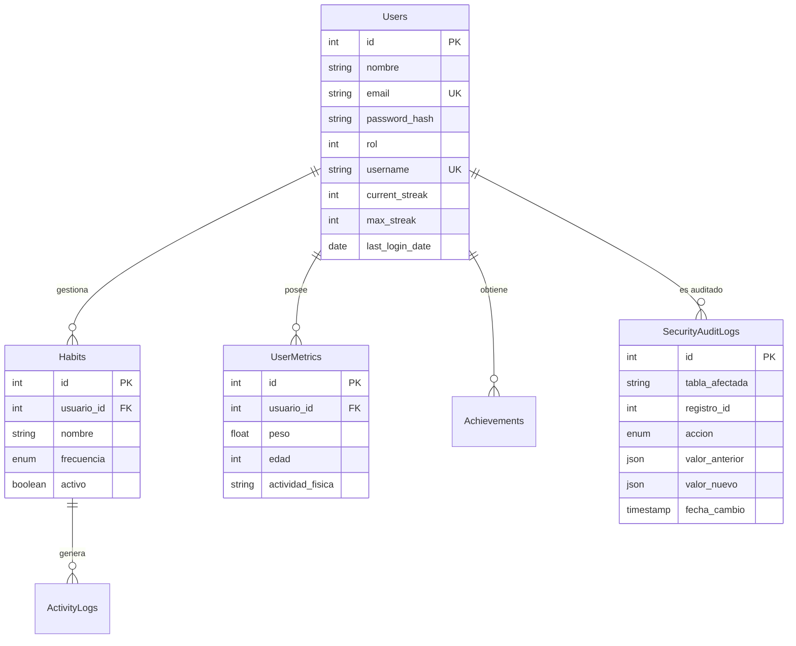

# 🗺️ MODELO RELACIONAL (MR) — QUANTIFY

```mermaid
erDiagram
    Users ||--o{ Habits : "gestiona"
    Users ||--o{ UserMetrics : "posee"
    Users ||--o{ Achievements : "obtiene"
    Users ||--o{ SecurityAuditLogs : "es auditado"
    Habits ||--o{ ActivityLogs : "genera"

    Users {
        int id PK
        string nombre
        string email UK
        string password_hash
        int rol
        string username UK
        int current_streak
        int max_streak
        date last_login_date
    }

    Habits {
        int id PK
        int usuario_id FK
        string nombre
        enum frecuencia
        boolean activo
    }

    UserMetrics {
        int id PK
        int usuario_id FK
        float peso
        int edad
        string actividad_fisica
    }

    SecurityAuditLogs {
        int id PK
        string tabla_afectada
        int registro_id
        enum accion
        json valor_anterior
        json valor_nuevo
        timestamp fecha_cambio
    }
```

---
**Nota Técnica**: El modelo utiliza una arquitectura de estrella simplificada para optimizar las consultas de gamificación y auditoría.
