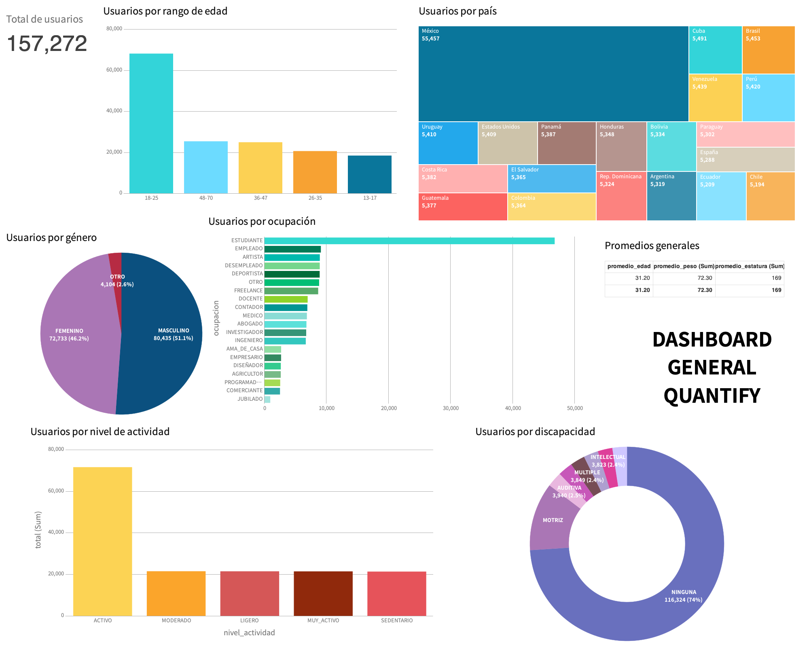

# Dashboard del Proyecto QUANTIFY

Esta carpeta contiene la evidencia correspondiente al apartado de Visualización y Calidad de la Información Generada del proyecto QUANTIFY.

El dashboard fue desarrollado en Navicat BI utilizando la información generada a partir de las pruebas SQL y NoSQL ejecutadas mediante Swagger.

## Objetivo

Representar visualmente los datos generados por el sistema mediante gráficas y tablas que permitan interpretar el comportamiento de los usuarios y validar la calidad de la información procesada.

## Herramienta utilizada

- Navicat BI
- MySQL
- MongoDB
- Swagger

## Información representada

El dashboard incluye visualizaciones relacionadas con:

- Total de usuarios registrados
- Usuarios por género
- Usuarios por nivel de actividad
- Usuarios por ocupación
- Usuarios por país
- Usuarios por discapacidad
- Usuarios por rango de edad
- Operaciones registradas en bitácora
- Registros históricos por fecha

## Validación

Las gráficas permiten analizar la información generada durante las pruebas automatizadas y comprobar la correcta persistencia y visualización de los datos dentro del sistema.
