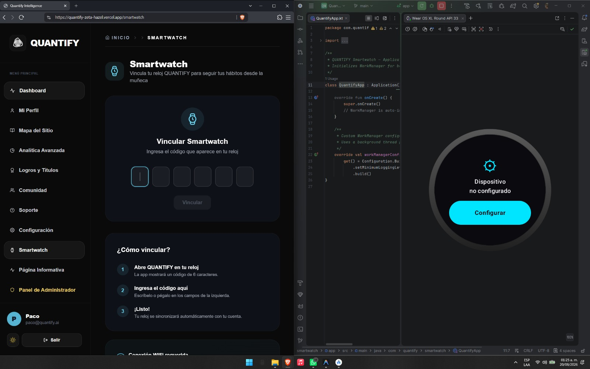
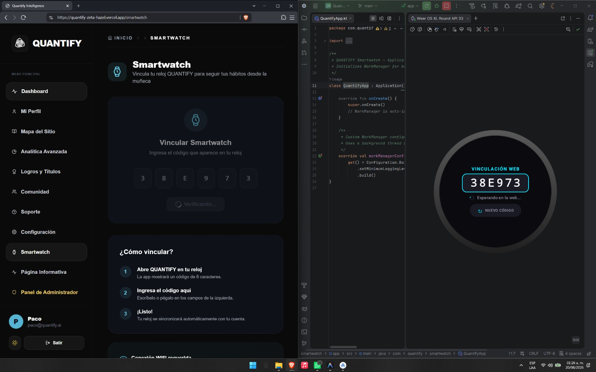
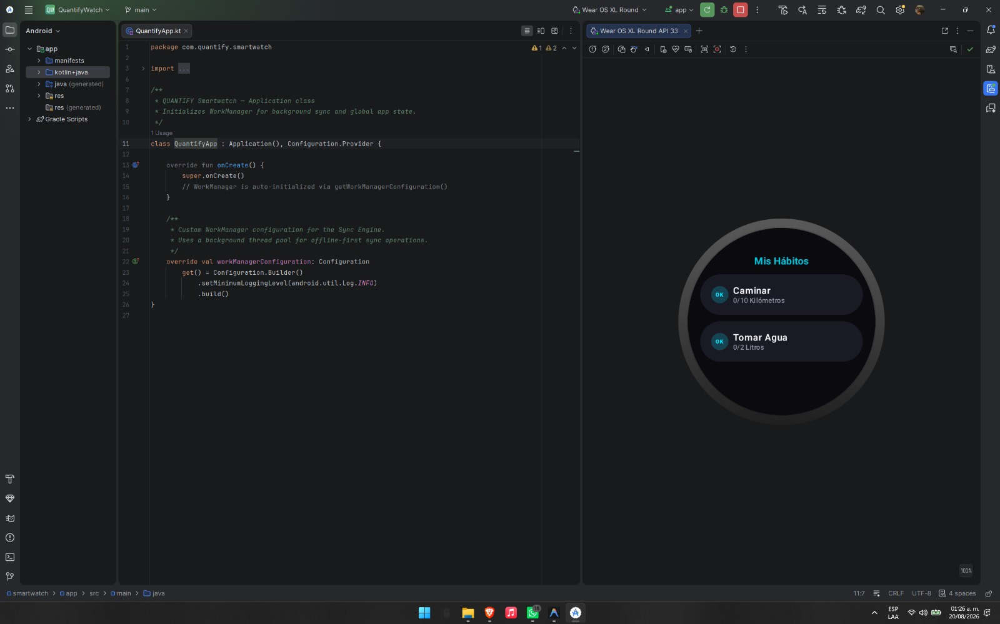
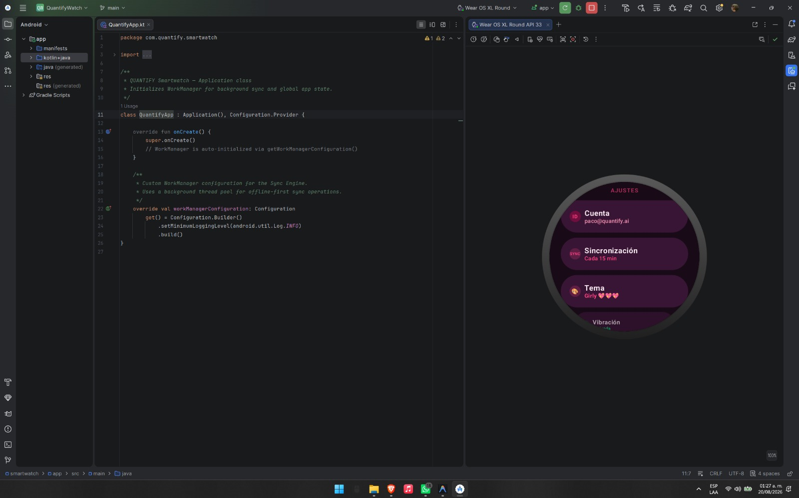
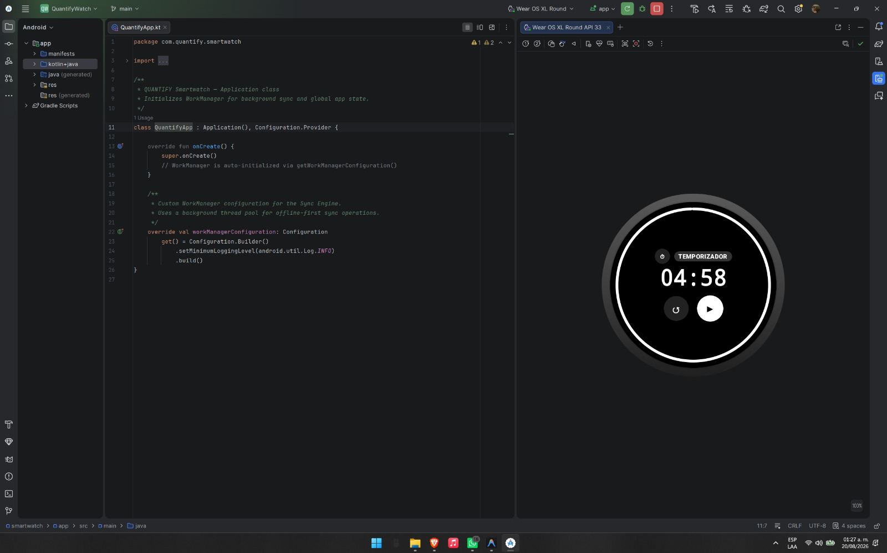
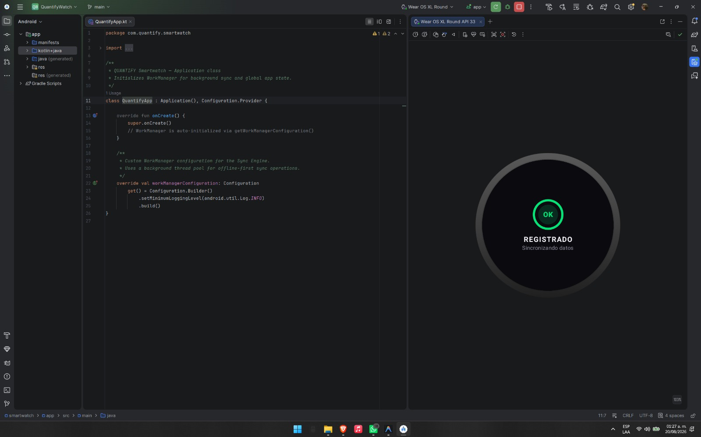

# Documentacion Oficial de QUANTIFY

Bienvenido a la documentacion oficial del proyecto QUANTIFY. 

## 1. Informacion Clave del Proyecto
QUANTIFY es una plataforma avanzada enfocada en el analisis de habitos, salud y productividad. El proyecto integra diversas fuentes de datos estructurados para procesar, normalizar y aplicar algoritmos de Machine Learning que detectan patrones de comportamiento, como el riesgo de *burnout* y la clasificacion de arquetipos de usuario. Se despliega mediante una arquitectura moderna orientada a servicios, ofreciendo dashboards en tiempo real, consumo via API y soporte para dispositivos diversos (Wearables, TV, Web).

## 2. Visibilidad y Estructura del Proyecto
Para facilitar la lectura y el mantenimiento, los documentos se han organizado por areas logicas:

- [Arquitectura (`/architecture`)](./architecture/): Diseño tecnico, modelado de datos y procesos ETL.
- [Datos (`/data`)](./data/): Manejo, origen de la informacion, metodologias (CRISP-DM) y politicas de privacidad.
- [Inteligencia Artificial (`/ai`)](./ai/): Integracion de modelos, uso y evaluacion de resultados.
- [Despliegue (`/deployment`)](./deployment/): Manuales de produccion.
- [Gestion y Planeacion (`/management`)](./management/): Planteamiento, contexto, roadmap y plan de asignacion.
- [Assets (`/assets`)](./assets/): Multimedia y bitacoras (prompting).

## 3. Integracion de Inteligencia Artificial (AI y Machine Learning)
El nucleo analitico de QUANTIFY se basa en modelos de Machine Learning entrenados y expuestos a traves de la API:

* **Modelos Supervisados**: Empleados para predecir escenarios con etiquetas claras, especificamente un clasificador para detectar probabilidad y riesgo de *Burnout* de un usuario basado en metricas historicas de estres, descanso y horas de trabajo. (Ver codigo en `notebooks/supervised/03_burnout_classifier.py`).
* **Modelos No Supervisados**: Utilizados para descubrir estructuras subyacentes en el uso del sistema sin etiquetas previas, como la segmentacion de *arquetipos de usuario* a traves de algoritmos de clustering (Ej. K-Means), permitiendo personalizar la experiencia del usuario (Ver codigo en `notebooks/unsupervised/04_user_archetypes.py`).

Estos modelos se empaquetan en `joblib` y son interceptados mediante subprocesos (`child_process`) dentro de los controladores de Node.js (`/api/ml/predict-burnout` y `/api/ml/predict-archetype`).

## 4. Uso de WebSockets (Sockets)
La plataforma requiere retroalimentacion inmediata al usuario, por ende, hace uso de la tecnologia de WebSockets (via `Socket.io`). Las notificaciones, predicciones generadas asincronamente y estatus de procesos analiticos envian eventos (como `ml_prediction_updated` o actualizaciones de activacion premium). Esto garantiza que componentes en el Frontend (Ej. `AnalyticsPage.jsx`) muten de estado en tiempo real sin requerir refrescos manuales (polling) por parte del usuario.

## 5. Capturas de Pantalla y Evidencias Visuales

### 5.1. Plataforma Web (Dashboard)

*(Ruta sugerida: integrar captura final en ./assets/images/)*

### 5.2. Smartwatch (Wearables)

La integracion de QUANTIFY con dispositivos Wear OS se realiza mediante un proceso de vinculacion segura con la plataforma web. A continuacion se documenta el flujo principal:

1. **Inicio y Configuracion**: Al abrir la aplicacion en el reloj por primera vez, el sistema detecta que no hay sesion e instruye al usuario a iniciar la configuracion.

2. **Generacion de Codigo OTP**: El reloj emite un codigo unico y temporal de 6 caracteres (ej. `38E973`). Este codigo se ingresa en el campo correspondiente dentro del modulo "Smartwatch" del Dashboard Web para autorizar de forma remota.

3. **Sincronizacion de Habitos**: Validado el token, el Smartwatch obtiene la informacion del usuario y muestra instantaneamente sus metricas diarias (ej. Caminar 0/10 KM, Tomar Agua 0/2 Litros).

4. **Ajustes y Personalizacion**: El panel de ajustes nativo del reloj permite validar la cuenta (`paco@quantify.ai`), modificar el intervalo de sincronizacion en segundo plano (ej. cada 15 min) y personalizar el tema grafico.

5. **Temporizador Nativo**: Funcionalidad de cuenta regresiva incorporada para el seguimiento de tiempos de enfoque o intervalos de descanso directamente desde la muñeca.

6. **Confirmacion de Registro**: Retroalimentacion visual ("REGISTRADO") que valida al usuario el exito de la transaccion mientras se sincronizan los datos en segundo plano.

### 5.3. Pantalla TV (Dashboard Ejecutivo)

*(Ruta sugerida: integrar captura final en ./assets/images/)*

### 5.4. Pruebas y Consumo API (Swagger/Postman)

*(Ruta sugerida: integrar captura final en ./assets/images/)*

