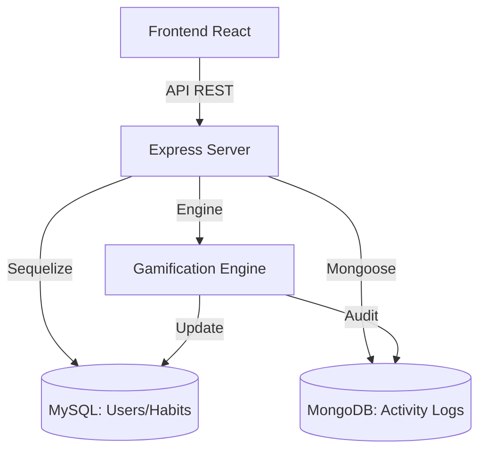

# Gestión de Proyecto (PMBOK) - QUANTIFY SYSTEM

> **Plataforma de Ingeniería Aplicada al Bienestar Personal (Advanced Habit Tracker)**  
> *Diseño UX/UI bajo el principio de "Engineering Aesthetic" (Estética oscura, precisa, minimalista e industrial).*

---

## Índice

- [1. Inicio del Proyecto](#1-inicio-del-proyecto)
- [2. Gestión de Alcance](#2-gestión-de-alcance)
- [3. Tecnologías Utilizadas](#3-tecnologías-utilizadas)
- [4. Descripción del Proyecto](#4-descripción-del-proyecto)
- [5. Documentación](#5-documentación)
- [6. Estructura del Proyecto](#6-estructura-del-proyecto)
- [7. Gestión de Recursos Humanos](#7-gestión-de-recursos-humanos)
- [8. Gestión de Interesados](#8-gestión-de-interesados)
- [9. Gestión del Tiempo](#9-gestión-del-tiempo)
- [10. Gestión de Costos](#10-gestión-de-costos)
- [11. Gestión de Adquisiciones](#11-gestión-de-adquisiciones)
- [12. Gestión de la Comunicación](#12-gestión-de-la-comunicación)
- [13. Gestión de la Calidad](#13-gestión-de-la-calidad)
- [14. Gestión de Riesgos](#14-gestión-de-riesgos)
- [15. Plan de Pruebas](#15-plan-de-pruebas)

---

## 1. Inicio del Proyecto

### Contexto y Justificación
En la era actual, la cuantificación de datos personales (Quantified Self) ha ganado terreno, pero la mayoría de las herramientas carecen de la robustez, precisión y estética necesarias para un usuario con mentalidad de ingeniero. **QUANTIFY SYSTEM** nace para resolver la necesidad de un seguimiento de hábitos avanzado y validado, eliminando los falsos positivos (rachas irreales) y basándose en un análisis de datos exhaustivo e inmutable. La justificación técnica y de negocio radica en ofrecer una plataforma de alto rendimiento capaz de procesar telemetría personal a escala y recompensar el esfuerzo constante mediante un motor de gamificación basado en datos duros.

---

## 2. Gestión de Alcance

### Requerimientos Funcionales
- **Registro y Autenticación:** Gestión segura de perfiles de usuario.
- **Seguimiento de Hábitos:** Creación, edición, completado y monitoreo de rutinas diarias.
- **Motor de Gamificación y Rachas:** Algoritmo que valida rachas reales y penaliza inactividad, procesando logs masivos de eventos.
- **Panel de Analíticas (Dashboard):** Visualización de telemetría de bienestar, niveles de estrés y cumplimiento.

### Requerimientos No Funcionales
- **Rendimiento:** Soporte y procesamiento de inyección masiva de datos (ej. 300,000 registros simultáneos).
- **Disponibilidad:** Uptime del 99.9% mediante infraestructura en la nube.
- **Estética:** Interfaz "Engineering Aesthetic" que ofrezca claridad, contraste oscuro y rápida legibilidad.
- **Escalabilidad:** Arquitectura de microservicios o modular para soportar un alto volumen de transacciones de telemetría y logs.

---

## 3. Tecnologías Utilizadas

La arquitectura se diseñó cuidadosamente bajo un enfoque **Híbrido de Persistencia**, separando responsabilidades transaccionales de las analíticas.

| Tecnología | Rol | Justificación Técnica |
| :--- | :--- | :--- |
| **React (Vite)** | Frontend | Permite una manipulación ágil del DOM virtual. Ideal para crear componentes reutilizables y fluidos requeridos en nuestra estética industrial ("Engineering Aesthetic"). |
| **Node.js + Express** | Backend (API) | Alta concurrencia gracias a su I/O no bloqueante. Facilita el procesamiento asíncrono de eventos y peticiones masivas del dashboard. |
| **MySQL** | Base de Datos Relacional | Garantiza **integridad transaccional** (ACID) estricta para la gestión de usuarios, roles, configuraciones y autenticación. |
| **MongoDB** | Base de Datos NoSQL | Actúa como el **Motor de Gamificación** y almacén de logs masivos de eventos (ej. telemetría de estrés). Su flexibilidad y escalabilidad horizontal permiten calcular la "racha real" sin bloquear las transacciones del núcleo. |

---

## 4. Descripción del Proyecto

### Planteamiento del Problema
Las aplicaciones de bienestar actuales son superficiales y fáciles de "engañar", permitiendo a los usuarios mantener rachas de hábitos sin validación real, además de carecer de interfaces profesionales que inviten a una inmersión técnica en el propio bienestar.

### Solución Propuesta
Un sistema dual que no solo registra la acción, sino que procesa telemetría de apoyo (como niveles de estrés y tiempo de actividad) para confirmar el esfuerzo. Todo envuelto en un diseño de software industrial y analítico.

### Objetivo General
Desarrollar y desplegar una plataforma web de rastreo de hábitos hiperprecisa que integre análisis masivo de datos mediante una arquitectura de persistencia híbrida, brindando métricas de progreso real en un entorno gamificado.

### Objetivos Específicos
1. Implementar la API RESTful híbrida que integre MySQL y MongoDB.
2. Construir la interfaz de usuario con temática *Engineering Aesthetic*.
3. Diseñar y validar el motor de cálculo de rachas reales bajo condiciones de estrés (300k registros).

---

## 5. Documentación

### Guía Rápida de Instalación

```bash
# 1. Clonar el repositorio
git clone <URL_DEL_REPOSITORIO>
cd QUANTIFY

# 2. Instalar dependencias del Backend
cd backend
npm install

# 3. Instalar dependencias del Frontend
cd ../frontend
npm install
```

### Configuración de Variables de Entorno (`.env`)

Crear un archivo `.env` en la raíz de `/backend` basado en el `.env.example`:

```env
# Servidor
PORT=3000
NODE_ENV=development

# MySQL (Usuarios y Autenticación)
DB_HOST=localhost
DB_USER=root
DB_PASSWORD=secret
DB_NAME=quantify_core

# MongoDB (Logs masivos y Gamificación)
MONGO_URI=mongodb+srv://<user>:<password>@cluster.mongodb.net/quantify_logs?retryWrites=true&w=majority

# JWT
JWT_SECRET=super_secret_engineering_key_2026
```

---

## 6. Estructura del Proyecto

El proyecto se divide de forma modular para aislar responsabilidades de cliente, servidor y documentación técnica.

```text
QUANTIFY/
├── backend/
│   ├── API/             # Controladores y rutas de Express
│   ├── config/          # Configuraciones de conexión a bases de datos
│   ├── NoSQL/           # Modelos y esquemas de Mongoose (Gamificación, logs)
│   ├── SQL/             # Modelos y migraciones para MySQL (Usuarios)
│   ├── utils/           # Helpers, middlewares y validaciones
│   ├── .env             # Variables de entorno
│   ├── server.js        # Punto de entrada de la aplicación Node
│   └── seed_test_data.js# Script de inyección masiva de datos (Pruebas)
├── frontend/
│   ├── public/          # Assets estáticos
│   ├── src/             # Código fuente de React (Componentes, Hooks, Context)
│   ├── index.html       # Entry point HTML
│   ├── package.json     # Dependencias del cliente
│   ├── tailwind.config.js # Configuración de diseño (Engineering Aesthetic)
│   └── vite.config.js   # Empaquetador y dev-server
└── docs/
    ├── arquitectura.md          # Detalles de arquitectura de software
    ├── modelo-datos.md          # Diagramas de Entidad-Relación y Colecciones
    ├── manual-despliegue-api.md # Guía para Ops/DevOps
    ├── vision-producto.md       # Product Scope
    ├── roadmap.md               # Sprints y planificación a futuro
    └── presentation/            # Material de presentaciones
```

### Arquitectura del Sistema


---

## 7. Gestión de Recursos Humanos

El equipo central sigue una estructura de responsabilidades clara y enfocada a la especialización:

| Colaborador | Rol Asignado | Github |
| :--- | :--- | :--- |
| **Angel de Jesús** | Tech Lead & Architecture | [@angelJesus13](https://github.com/angelJesus13) |
| **Francisco Garcia G** | Lead Backend Developer | [@DevFntxy](https://github.com/F-Anks) |
| **Farias Leyva** | Frontend & Documentation | [@farias](https://github.com/fariasdgs) |
| **Artiaga Morales** | QA & Data Science | [@artiaga](https://github.com/JesuuusArt) |

---

## 8. Gestión de Interesados

| Interesado | Expectativas / Criterios de Éxito | Nivel de Influencia |
| :--- | :--- | :--- |
| **Usuarios Finales** | Interfaz rápida, sin bugs, precisión estricta en el conteo de sus hábitos y privacidad de datos. | Alto |
| **Equipo de Desarrollo** | Código limpio, documentación técnica clara, infraestructura estable para pruebas. | Alto |
| **Stakeholders / Auditores** | Cumplimiento del alcance y tiempo, escalabilidad demostrable del sistema, reportes de métricas transparentes. | Alto |

---

## 9. Gestión del Tiempo

El proyecto se gestiona mediante un esquema de desarrollo ágil basado en Sprints:

- **Fase 1: Planning & Setup (Semanas 1-2)** - Levantamiento de requerimientos, diseño UI y despliegue del esqueleto de directorios.
- **Fase 2: Core Data & Backend (Semanas 3-5)** - Implementación de MySQL (Autenticación) y MongoDB (Motor de eventos).
- **Fase 3: Frontend & Integración (Semanas 6-8)** - Construcción del Dashboard y conexión con los endpoints.
- **Fase 4: Testing & Stress (Semana 9)** - Ejecución de inyección de 300,000 registros e identificación de cuellos de botella.
- **Fase 5: Release & Docs (Semana 10)** - Refinamiento final de UI/UX, actualización de manuales de despliegue y lanzamiento.

---

## 10. Gestión de Costos

Estimación mensual básica para el despliegue del entorno en producción (Infraestructura Cloud):

| Recurso / Servicio | Proveedor Sugerido | Propósito | Costo Estimado (Mensual) |
| :--- | :--- | :--- | :--- |
| **Instancia Computacional** | AWS EC2 (t3.medium) / DigitalOcean | Hosting del servidor Node.js y Frontend estático | $15.00 - $20.00 |
| **Base de Datos SQL** | AWS RDS / DigitalOcean Managed | Instancia MySQL administrada, alta disponibilidad | $15.00 - $25.00 |
| **Base de Datos NoSQL** | MongoDB Atlas (M10) | Cluster para escalabilidad y logs de gamificación | $9.00 - $15.00 |
| **Dominio y SSL** | Cloudflare / Name custom | Enrutamiento, seguridad y caché (CDN) | $1.50 |
| **Total Estimado** | | | **~$40.50 - $61.50** |

---

## 11. Gestión de Adquisiciones

- **AWS / DigitalOcean:** Proveedores de infraestructura como servicio (IaaS) para el despliegue del backend.
- **MongoDB Atlas:** Adquisición de base de datos como servicio (DBaaS) para eliminar el *overhead* administrativo del manejo de clústeres NoSQL.
- **Github (Enterprise/Pro):** Repositorio central de código, control de versiones y CI/CD pipelines.
- **Librerías de Terceros:** Uso exclusivo de librerías Open Source licenciadas (MIT/Apache) como Express, Mongoose, Sequelize/Prisma, y TailwindCSS.

---

## 12. Gestión de la Comunicación

Para garantizar el flujo correcto de la información dentro del equipo:
- **Canal de Comunicación Asíncrona:** Slack o Discord (Canales divididos: `#dev-backend`, `#dev-frontend`, `#qa-alerts`).
- **Control de Tareas:** Jira o Trello (Tablero Kanban).
- **Daily Stand-ups:** Reuniones de 15 minutos para blockers y progreso.
- **Sprint Review & Retrospective:** Al final de cada iteración para evaluar entregables y ajustar procesos de comunicación.

---

## 13. Gestión de la Calidad

- **Umbral de Rendimiento:** El dashboard de usuario y carga inicial de la aplicación debe ocurrir en `< 1.5 segundos`.
- **Latencia de API:** Las peticiones transaccionales críticas (login, crear hábito) deben resolverse en `< 200ms`.
- **Estándares de Código:** Uso de `ESLint` estricto en frontend y backend para mantener el estándar del *Engineering Aesthetic* incluso en el código fuente.
- **Manejo de Errores:** Todos los endpoints deben retornar códigos HTTP estándar (200, 201, 400, 401, 403, 500) con payloads de error uniformes en JSON.

---

## 14. Gestión de Riesgos

| Riesgo Identificado | Impacto | Probabilidad | Estrategia de Mitigación |
| :--- | :--- | :--- | :--- |
| **Saturación en MongoDB por Logs Masivos** | Alto | Media | Implementar índices adecuados en colecciones de telemetría y aplicar *Time Series Collections* o rotación de datos antiguos. |
| **Caída de la Base de Datos MySQL** | Crítico | Baja | Usar servicios gestionados (RDS) con backups automatizados diarios y recuperación Point-in-Time. |
| **Desfase en la comunicación Frontend/Backend** | Medio | Alta | Adoptar un enfoque "API-First" con contratos (Postman/Swagger) definidos antes del desarrollo de vistas. |
| **Cuellos de botella en la inyección de 300k registros** | Alto | Alta | Procesamiento por lotes (Batch processing/Bulk Inserts) en el script `seed_test_data.js` en lugar de inserciones 1 a 1. |

---

## 15. Plan de Pruebas

Para garantizar la estabilidad del motor de gamificación y validar la arquitectura híbrida, se define la siguiente estrategia:

### Pruebas Unitarias y de Integración
- Validaciones en los controladores de autenticación y creación de perfiles (MySQL).
- Verificación del cálculo del algoritmo de "Racha Real" comprobando inputs válidos e inválidos (MongoDB).

### Prueba de Estrés: Inyección de 300,000 Registros
- **Objetivo:** Simular un entorno de producción con alta actividad y probar la tolerancia del Motor de Gamificación.
- **Herramienta:** Script interno Node.js (`backend/seed_test_data.js`) / Herramientas de carga como K6 o JMeter.
- **Procedimiento:**
  1. Ejecutar el script que generará *bulk inserts* simulando eventos de estrés y telemetría histórica.
  2. Monitorear los tiempos de inserción y la latencia en MongoDB Atlas.
  3. Ejecutar peticiones GET de lectura al dashboard simultáneamente durante la inyección.
- **Criterio de Éxito:** El sistema procesa los 300k registros sin causar *Timeout* en las peticiones concurrentes del frontend y calculando correctamente el panel de análisis posterior a la inyección.
